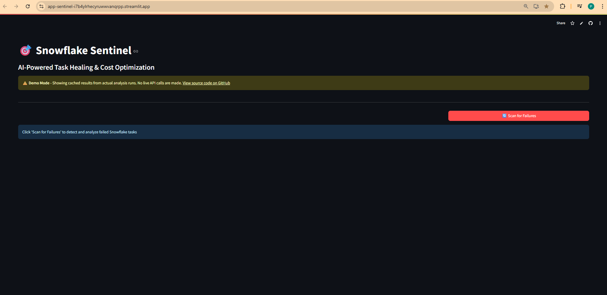
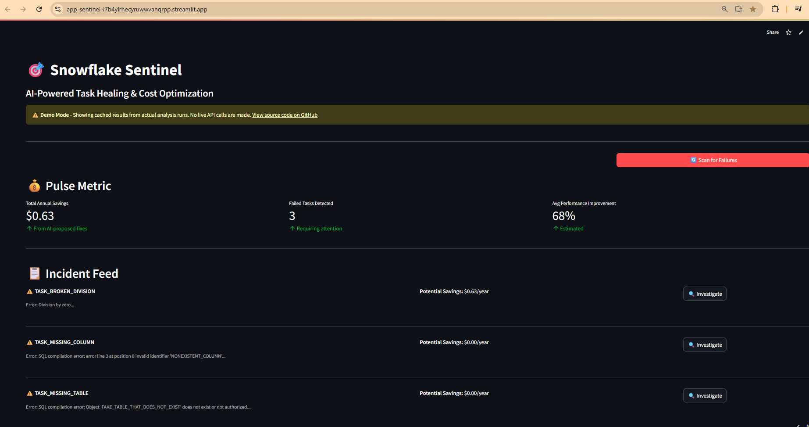

# Snowflake Sentinel — AI-Powered Task Failure Detection & Diagnosis

**Live Demo:** https://app-sentinel-i7b4ylrhecyruwwvanqrpp.streamlit.app/  
**Source:** https://github.com/pushkersahai/snowflake-sentinel

Snowflake Sentinel is a **multi-agent DataOps/FinOps assistant** that detects failed Snowflake tasks, performs **LLM-assisted root cause analysis**, and estimates **compute-credit impact**—with an optional human-in-the-loop workflow for production use.

> **Demo note:** The public Streamlit demo runs in **cached mode** with pre-analyzed results.  
> The full system connects to **Snowflake ACCOUNT_USAGE** + **Anthropic Claude** for real-time analysis.

---

## Why this exists

When scheduled tasks fail, teams lose time in triage and risk downstream pipeline breakage.
Sentinel helps by:
- **Surfacing unique failures** (deduped by task)
- **Explaining root cause** (error + query + schema context)
- **Recommending a fix** (corrected SQL + rationale)
- **Quantifying impact** (credits per run + annualized projection)

### Dashboard & Pulse Metrics


### Incident Feed


### AI Reasoning Chain


## Overview

Snowflake Sentinel monitors task execution metadata, performs root cause analysis using Claude 3.5 Sonnet, and quantifies the operational impact of failures. The system implements a deterministic orchestration pattern with human-in-the-loop approval for production deployments.

## Architecture
```
┌─────────────────────────────────┐
│  Snowflake ACCOUNT_USAGE        │
│  - TASK_HISTORY                 │
│  - QUERY_HISTORY                │
└──────────────┬──────────────────┘
               │
      ┌────────▼────────┐
      │  Agent Layer    │
      │  - Detection    │
      │  - Analysis     │
      │  - Calculation  │
      └────────┬────────┘
               │
         ┌─────▼──────┐
         │ Claude API │
         └─────┬──────┘
               │
      ┌────────▼────────┐
      │  Streamlit UI   │
      └─────────────────┘
```

### Components

**SentryAgent**  
Queries `TASK_HISTORY` to identify failed task executions. Deduplicates by task name to surface unique failures.

**ForensicAgent**  
Retrieves query text and table schemas from Snowflake metadata. Constructs context for Claude API to perform root cause analysis and propose SQL corrections.

**CFOAgent**  
Calculates compute credit consumption based on warehouse size and execution time. Projects annualized impact using task schedule frequency.

**NotificationAgent**  
Generates structured email alerts with failure context, proposed fixes, and approval workflow links.

## Prerequisites

- Python 3.10 or higher
- Snowflake account with `ACCOUNT_USAGE` access
- Anthropic API access
- SMTP credentials for email notifications

## Installation
```bash
git clone https://github.com/pushkersahai/snowflake-sentinel.git
cd snowflake-sentinel

python -m venv venv
source venv/Scripts/activate  # Windows
# source venv/bin/activate    # Unix

pip install -r requirements.txt
```

## Configuration

### Using Environment Variables

Create `.env` file:
```bash
SNOWFLAKE_ACCOUNT=your_account_locator
SNOWFLAKE_USER=your_username
SNOWFLAKE_PASSWORD=your_password
SNOWFLAKE_WAREHOUSE=COMPUTE_WH
SNOWFLAKE_DATABASE=SNOWFLAKE
SNOWFLAKE_SCHEMA=ACCOUNT_USAGE

ANTHROPIC_API_KEY=your_api_key

NOTIFICATION_EMAIL_FROM=sender@example.com
NOTIFICATION_EMAIL_TO=team@example.com
NOTIFICATION_EMAIL_PASSWORD=app_password
```

### Using AWS Secrets Manager (Recommended for Production)
```python
import boto3
from botocore.exceptions import ClientError

def get_secret(secret_name):
    session = boto3.session.Session()
    client = session.client(
        service_name='secretsmanager',
        region_name='us-west-2'
    )
    
    try:
        get_secret_value_response = client.get_secret_value(
            SecretId=secret_name
        )
        return json.loads(get_secret_value_response['SecretString'])
    except ClientError as e:
        raise e

# Usage in agents
secrets = get_secret('snowflake-sentinel/prod')
conn = snowflake.connector.connect(
    account=secrets['snowflake_account'],
    user=secrets['snowflake_user'],
    password=secrets['snowflake_password']
)
```

### Using Azure Key Vault
```python
from azure.identity import DefaultAzureCredential
from azure.keyvault.secrets import SecretClient

def get_secret(vault_url, secret_name):
    credential = DefaultAzureCredential()
    client = SecretClient(vault_url=vault_url, credential=credential)
    return client.get_secret(secret_name).value

# Usage
VAULT_URL = "https://your-keyvault.vault.azure.net/"
snowflake_password = get_secret(VAULT_URL, "snowflake-password")
```

## Test Environment Setup

Execute SQL scripts in order:
```bash
# Creates test database with intentionally failing tasks
sql_setup/01_create_test_environment.sql

# Queries to verify failure detection
sql_setup/02_check_task_failures.sql
```

## Usage

### Command Line
```bash
# Test Snowflake connectivity
python test_connection.py

# Run investigation workflow
python sentinel_crew.py

# Launch interactive dashboard
streamlit run app.py
```

### Programmatic
```python
from sentinel_crew import SnowflakeSentinelCrew

crew = SnowflakeSentinelCrew()
results = crew.run_investigation()

for result in results:
    print(f"Task: {result['task_name']}")
    print(f"Diagnosis: {result['investigation']['diagnosis']}")
    print(f"Projected Impact: {result['savings']}")
```

## Project Structure
```
snowflake-sentinel/
├── agents/
│   ├── sentry_agent.py          # Task failure detection
│   ├── forensic_agent.py        # Root cause analysis with LLM
│   ├── cfo_agent.py             # Cost impact quantification
│   └── notification_agent.py    # Alert generation
├── sql_setup/
│   ├── 01_create_test_environment.sql
│   └── 02_check_task_failures.sql
├── docs/
├── sentinel_crew.py             # Orchestration layer
├── app.py                       # Streamlit interface
├── test_connection.py
├── requirements.txt
└── README.md
```

## Design Decisions

### Deterministic Orchestration

The system uses explicit sequencing (Sentry → Forensic → CFO) rather than autonomous agent decision-making. This ensures:

- Predictable execution paths for production environments
- Simplified debugging and observability
- Reduced LLM API costs (1 call vs. 5-10 for agentic orchestration)
- Consistent audit trails


### Prompt Engineering Strategy

Claude API receives structured context:
- SQL query text from `QUERY_HISTORY`
- Error message from `TASK_HISTORY`
- Table DDL via `GET_DDL()` function

Response is parsed for three components:
1. ROOT CAUSE - Natural language explanation
2. FIXED SQL - Corrected query
3. EXPLANATION - Change rationale

This structured approach reduces hallucinations and improves parseability.

### Cost Calculation Methodology

Credit consumption formula:
```
credits_per_run = (execution_time_seconds / 3600) × warehouse_credits_per_hour
annual_credits = credits_per_run × (executions_per_year)
```

Warehouse credit mappings based on Snowflake documentation:
- X-Small: 1 credit/hour
- Small: 2 credits/hour
- Medium: 4 credits/hour
- Large: 8 credits/hour

Performance improvements are estimated using heuristics (5% for logic fixes, 30% for index additions, 100% for compilation errors). Production deployments should validate with `EXPLAIN PLAN` analysis.

## Security Considerations

### Credential Management

- **Development:** `.env` file (excluded from git)
- **Production:** AWS Secrets Manager, Azure Key Vault, or HashiCorp Vault
- **Snowflake:** Key-pair authentication recommended over password

### Access Control

System requires read-only access to:
- `SNOWFLAKE.ACCOUNT_USAGE.TASK_HISTORY`
- `SNOWFLAKE.ACCOUNT_USAGE.QUERY_HISTORY`
- Source schemas for `GET_DDL()` execution

Optional write access for auto-deployment feature (not implemented in current version).

### Data Privacy

- No query result data is extracted
- Only metadata (query text, error messages) is processed
- Claude API calls include SQL and schema information
- Refer to Anthropic's data retention policies for compliance requirements

## Testing
```bash
# Unit tests for individual agents
pytest tests/test_sentry_agent.py
pytest tests/test_forensic_agent.py
pytest tests/test_cfo_agent.py

# Integration test with mock Snowflake connection
pytest tests/test_integration.py

# End-to-end test (requires live Snowflake connection)
pytest tests/test_e2e.py
```

## Deployment

### Streamlit Community Cloud
```bash
# Free tier, suitable for demos
# Requires public GitHub repository
```

### AWS ECS/Fargate
```dockerfile
FROM python:3.10-slim

WORKDIR /app
COPY requirements.txt .
RUN pip install -r requirements.txt

COPY . .
CMD ["streamlit", "run", "app.py", "--server.port=8501"]
```

### Docker Compose
```yaml
version: '3.8'
services:
  sentinel:
    build: .
    ports:
      - "8501:8501"
    environment:
      - SNOWFLAKE_ACCOUNT=${SNOWFLAKE_ACCOUNT}
    env_file:
      - .env
```

## Limitations

- **Metadata Lag:** `ACCOUNT_USAGE` views have 15-45 minute latency
- **Claude Rate Limits:** Default tier supports 50 requests/minute
- **Error Pattern Coverage:** Current heuristics cover common SQL errors; edge cases may require custom logic
- **Cost Estimates:** Performance improvements are projected, not measured via query profiling

## Roadmap

- [ ] Integration with `INFORMATION_SCHEMA` for near real-time detection
- [ ] Support for dbt model failures via `manifest.json` parsing
- [ ] Automated fix deployment with rollback capability
- [ ] Pattern recognition using historical failure data
- [ ] Multi-cloud support (Databricks, BigQuery)

## References

- [Snowflake ACCOUNT_USAGE Views](https://docs.snowflake.com/en/sql-reference/account-usage.html)
- [Anthropic Claude API Documentation](https://docs.anthropic.com/)
- [CrewAI Framework](https://docs.crewai.com/)
- Snowflake Credit Consumption: [Warehouse Credit Usage](https://docs.snowflake.com/en/user-guide/cost-understanding-compute.html)

## Contributing

This is a portfolio project demonstrating multi-agent systems architecture. Feedback and suggestions are welcome via GitHub issues.

## License

MIT License

## Author

Pushker Sahai


**Note:** This project is for demonstration and educational purposes. Production deployments should include comprehensive testing, monitoring, and security hardening.
